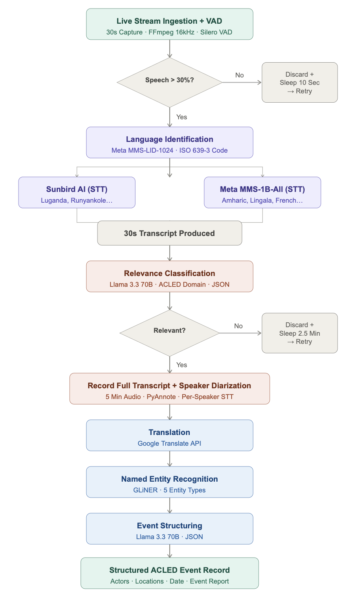

# Extracting Conflict Events from Radio-Based News 

## Overview
An end-to-end NLP pipeline that monitors live African radio broadcasts (in the DRC, Uganda, and Ethiopia) to automatically extract and structure geopolitical conflict events. 

## Technologies Used
* Languages: Python, PyTorch, Hugging Face Transformers, FFmpeg
* Audio Processing: FFmpeg, Silero VAD, PyAnnote (Speaker Diarization)
* Speech-to-Text (STT): Sunbird AI, Meta MMS-1B-All, Meta MMS-LID-1024
* Translation & NER: Google Translate API, GLiNER (Zero-shot NER)
*  LLMs: Llama 3.3 (70B) via Groq API

## Pipeline Architecture

## Full Technical Report
You can read the detailed project report, which includes the full methodology, experimental results, and comprehensive limitation analysis, here:
[Read the Full Technical Report](assests/DOCUMENTATION_REPORT.pdf).

## How to Run (Google Colab)
This pipeline is optimized for Google Colab. To run it:
* Open RadioEventsExtractionPipeline.ipynb in Google Colab
* Add the following keys where needed in the cells:
  * GROQ_API_KEY
  * SUNBIRD_API_TOKEN
  * HF_TOKEN
* Run all cells

## Output
For every verified conflict event detected, the pipeline automatically generates three files:
* [country]_audio_[id].wav: The cleaned, 5-minute raw audio recording
* [country]_transcript_[id].txt: The full, diarized text transcript before translation
* [country]_event_[id].txt: The full report for the 5 minute recording, including the stream name, the raw transcript, the translated transcript, the GLiNER entities, and the Structured Events
